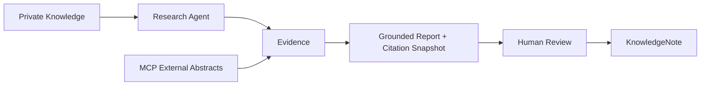

# AI 研究工作台

AI Research Workspace · AI 研究 Agent 毕业项目实战

把私人资料、外部研究证据和受限 Agent Workflow 组合起来，生成可追溯研究报告，并通过人工确认沉淀知识。

## Demo

**CLOUD DEPLOYMENT NOT VERIFIED**。目前没有已验证的 HTTPS Demo URL。已完成本地 Docker production-mode、真实 Provider/Crossref 与私有 Garage 验证，详见 [交付证据](docs/release-evidence.md)。不宣称 Production Ready。

## Why

研究资料散落在文件和外部搜索里，结论很难回溯来源；普通聊天历史也不适合长期管理研究任务。工作台以 Task 为长期目标、Run 为一次执行，保留报告与证据，再由用户决定哪些内容值得保存。

## What it does / Product Flow



## Key Features

- 私有 TXT/Markdown/PDF ingestion，page/offset locator 与 pgvector scoped retrieval。
- Grounded Report 的 claim 只能引用本次允许的 Evidence；Citation Snapshot 独立于原资料生命周期。
- bounded Research Agent：4 model turns、3 tool calls、10 provider units、120 秒 deadline 与取消。
- MCP 只暴露固定 Crossref scholarly search；abstract 可作 Evidence，metadata 仅作参考。
- Human-in-the-loop：post-run Proposal → Review/Edit → exact approval → atomic KnowledgeNote；重放幂等。
- 固定 Product Eval 与独立安全 Hard Gates，交付用依赖/环境检查、Docker、故障恢复和 smoke。

## Trust & Safety

Session 在服务端解析，Workspace 由 User 推导；浏览器和模型不决定资源归属。对象私有且短期签名访问。工具只读；Note 写入由精确绑定的 HMAC token、version/canonicalArgs、事务锁和幂等键授权。

安全结论来自独立边界测试；不能从 UI 隐藏、Judge 分数或普通平均通过率推导。stale Run reconciliation 只终结中断执行，不自动 Resume/Approve。

## Architecture

Next.js modular monolith → PostgreSQL/pgvector；server-only Provider、private S3-compatible storage、固定 MCP endpoint。见 [系统图与信任边界](docs/architecture.md)、[部署决策](docs/deployment-decision.md)。

## Eval

在 C9 依赖修复后复跑 C8 deterministic Product Eval：**25/25**，Hit@3 **10/10**，MRR **0.95**；全部八项 zero-only Hard Gates 为0。固定 synthetic 数据集，这不是现实世界准确率。

C8 历史 controlled real run：默认词法规则 **8/9**；optional Judge **9/9**，但 `lexical_fidelity_flags = 1` 仍保留，需要人工语义复核。Judge 不替代安全门。C9 另外完成两条真实端到端 smoke，不把它改称完整 real Eval；真实 Provider 测试曾两次 MODEL_FAILED，随后受控 smoke 通过，不能推导稳定成功率。

## Tech Stack

Next.js 15.5.27、TypeScript、React 19、PostgreSQL、Prisma 6.19.3、pgvector（1024）、S3-compatible storage、MCP、server-side AI Provider。PostCSS/deepmerge-ts 锁定修复版本；见 [依赖修复](docs/dependency-remediation.md)。

## Run Locally

使用 Node>=20.19，独立 PostgreSQL/pgvector 与私有 S3-compatible bucket。复制 `.env.example` 为 ignored 本地配置，替换全部占位值；不要用平台 DB。默认 mock，真实 Provider 必须单独显式配置。

```bash
npm ci
npm run db:migrate
npm run dev
```

已有 C1 项目要保留自己的产品文档；作者 Reference 是标准验证样例。

## Deployment

从 [deployment.md](docs/deployment.md) 执行环境检查、独立 Test/Eval release gate、Docker build/run、备份与 migration、Staging Full Smoke、Production Safe Smoke。健康探针只证明进程响应。

## Portfolio

[三分钟 Demo](docs/demo-script.md) · [简历条目](docs/resume-project.md) · [面试框架](docs/interview-guide.md) · [复盘](docs/retrospective.md)

## Known Limitations

同步 research，无 background worker/queue，容量和代理时限需真实云验证。进程 crash 用手动/运维调度的 stale-run fail-closed recovery，不恢复半次执行。外部 Provider/Crossref 可失败，输出和 abstract 支持程度仍需人判断。小 synthetic Eval 不代表分布外数据。暂无 OCR、Team/RBAC、Note indexing；Notes 不回流 RAG。

云生产存储 IAM/CORS、HTTPS/MCP、备份恢复与回滚尚 NOT VERIFIED。当前为内部 Reference，Capstone 课程未发布；正式发布另需 Final Capstone Release Readiness Audit。
