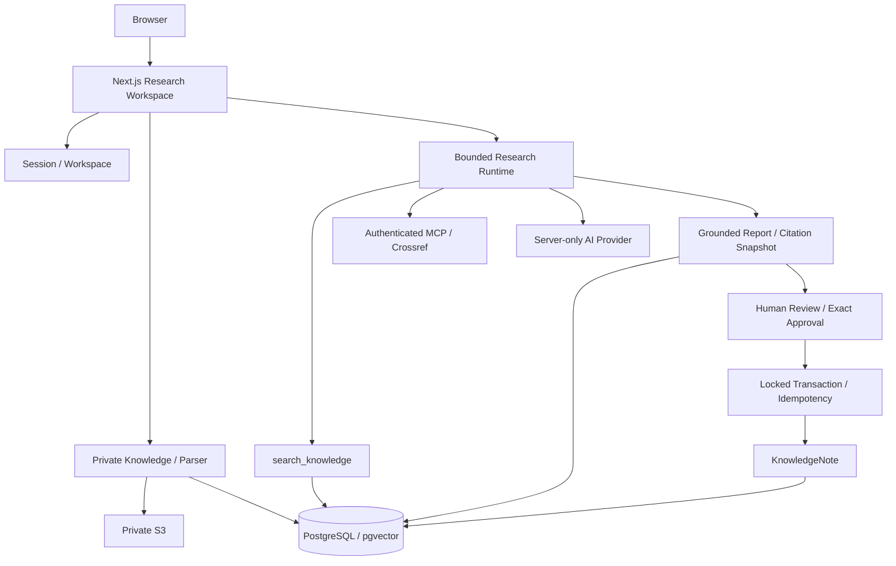
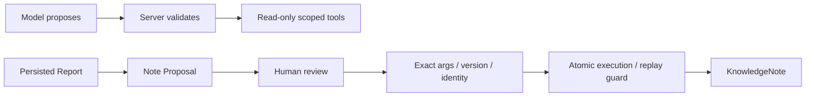

# AI 研究工作台 · Architecture

一个 Next.js modular monolith，Auth、Knowledge、Research、Grounding、Approval 由领域模块分开，只有一个部署单元。Task 是长期研究目标，Run 是执行记录；Workspace 为文件、任务和笔记提供统一归属作用域。

系统图源：`architecture.mmd`。下面可直接在 GitHub 查看：

## Trust Boundary

完整 trust 图源见 `trust-boundary.mmd`。外部 metadata 不进入 claim allowed set；模型看见资料不等于取得权限。Note 是 post-run Action，不是 Agent 内写工具；Notes 当前不进入知识索引。

## Failure and operations

每 Run 4 model turns/3 tools/10 units/120 秒。structured log 只保留 event/runId/step/status/errorCode/latencyMs。运行超时/取消有明确终态；进程突然死亡由 release/maintenance reconciliation 检查 startedAt 和所有近期 Step，十分钟无活动才失败，不 Resume、不 Approve。

当前没有 queue/worker。云生产目标、隔离环境、migration、存储、HTTPS、回滚见 deployment-decision.md 和 deployment.md；验证状态见 release-evidence.md，不能从图推导已经上线。
