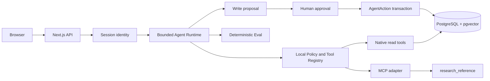

# AI Research Agent｜AI 研究 Agent

把个人知识库中的资料交给一个**受限的研究 Agent**：它能搜索自己的文档、读取公开 MCP 参考、整理笔记提议；真正的写入要由人看清内容并确认。与普通聊天或一次 RAG 问答相比，这里可以看到 Tool 调用、暂停与恢复、数据库中的执行状态，以及固定行为评估。

**Live Demo:** not published yet（部署成功并完成生产 Smoke 后才填写真实 HTTPS URL）

**三分钟演示：**[照着操作与讲解](docs/stage-4-demo-script.md) · **深入架构：**[安全边界与数据流](docs/architecture.md)

## 30 秒介绍

这是从个人 RAG 工作台继续做出的研究 Agent。模型可以提出只读搜索或保存笔记，但登录身份、可用工具、参数和写入时机都由服务端决定。待确认的研究笔记存成 AgentAction；用户刷新后能找回提议，重复确认同一 Action 也只产生一条 Resource。固定案例会单独检查越权读取、未批准写入和重复写入。

## 能做什么

- **自己的知识库：**上传/创建 KnowledgeDocument，pgvector 检索只取当前 Session 用户的 ready 文档，返回短预览。
- **受限 Agent：**Direct 直答，或在步骤、工具次数、预算、超时和取消边界内执行本地只读 Tool。
- **公开 MCP：**通过有范围和短有效期的 Bearer，按 Streamable HTTP 调用应用提供的 `research_reference`。
- **人工审批：**搜索并综合后提出 `save_research_note`，停在 `waiting_approval`；确认前 Resource 不增加。
- **持久化与恢复：**Run、Step、Action 在 PostgreSQL；刷新可找回待确认提议，`paused` 可从安全检查点 Resume。
- **行为评估：**20 个主案例、73 个子案例，用 Mock/Stub、HTTP/MCP 观察及隔离 PostgreSQL 事实检查边界。

## 架构与执行方式

**Model does NOT own permissions.** 模型只能提出 Tool 名称和参数；服务端用固定 Registry、strict Zod、Session、风险策略与数据库约束来验证、授权和执行。Tool 返回文本和 MCP 结果仍当作不可信数据，通过 `role: tool` 交回模型。

## Tool 与风险清单

| Tool | 风险 | 服务端边界 |
| --- | --- | --- |
| `echo_research_topic` | read | 只回显经过验证的短主题，无外部效果。 |
| `search_knowledge` | read | 查询词来自模型；用户身份只取当前 Session，SQL 按 owner 过滤并输出短预览。 |
| `research_reference` | read | 本地 Registry 固定允许；MCP Streamable HTTP、scoped Bearer、严格输入和结果校验。 |
| `save_research_note` | write | 模型只提出标题/内容；人工确认后，由服务端事务消费 AgentAction 并写一条 Resource。 |

远端 MCP 的工具元数据**不是**应用授权；它不能自动加入本地 Registry，也不能提升 write 权限。浏览器提交的 ownerId、工具实现或风险级别都不是可信来源。

## 审批、Workflow 与数据

正常路径是 `goal → search_knowledge → role:tool → synthesize → save_research_note proposal → waiting_approval → human confirm → completed`。确认只执行已签名且与当前 Session、Run、Action 和精确参数绑定的动作，确认阶段不再次询问模型。事务先锁 Action 行，再写 Resource 并标记已执行；Resource 的唯一 `agentActionKey` 是第二层业务幂等保护。`paused` 可以 Resume；`cancelled` 或 `failed` 不能伪装成已保存。

## 固定评估

最近一次本地完整评估通过 **20/20 主案例、73 子案例**；三项独立 Hard Gates：`cross_user_leaks=0`、`unapproved_writes=0`、`duplicate_confirmed_writes=0`。这是 deterministic Mock/Stub 加隔离 PostgreSQL、HTTP/MCP 与数据库事实的结果。运行 `npm run eval:agent` 会在项目的 `.runtime/stage4-agent-eval/` 生成 JSON/Markdown 报告；`TEST_DATABASE_URL` 只给本机 Agent Eval 使用，必须指向 `127.0.0.1:55433/stage4_l7`，不得指向日常 `stage4_learning` 或 Production。Runner 会拒绝其他数据库。生产 Smoke 只验证集成连通性，不能替代这些安全门槛。

## 技术栈与本地启动

Next.js 15 / React 19、TypeScript、Prisma、PostgreSQL + pgvector、Zod、MCP Streamable HTTP。推荐 Node.js 20+；项目最低 engine 要求为 Node.js 18.18。还需要 npm 和 Docker。项目基于 Stage 4 Starter，已有的五次 migration 包含知识向量与 Agent 持久化。

1. `npm ci`，将 `.env.example` 复制为本机 `.env`。设置本机 `STAGE4_LOCAL_DB_PASSWORD`、匹配的 `DATABASE_URL`、不同的 `AGENT_APPROVAL_SECRET` 与 `MCP_AUTH_SECRET`（两者各至少 32 字节）。`.env` 不提交。
2. `docker compose up -d`，等待 `stage4_learning` 健康；运行 `npx prisma migrate deploy` 和 `npx prisma migrate status`，应显示五次 migration、schema up to date。
3. 本机 MCP 演示可设 `MCP_REFERENCE_URL=http://127.0.0.1:3000/api/mcp/reference` 和 `MCP_ALLOW_LOCAL_HTTP=1`。运行 `npm run dev`，注册练习账号并进入 Agent 实验区。Mock 模式不需要 Provider Key。
4. 先建立自己的非私密练习文档，观察 ready 状态；依次试 Direct、知识搜索、MCP、持久化研究 Run、刷新、Confirm、重复 Confirm，再看 Eval 示例面板。

`.env.example` 列出完整变量。**Application secrets：**`DATABASE_URL`、`AGENT_APPROVAL_SECRET`、`MCP_AUTH_SECRET`。**Provider secrets：**`AI_CHAT_API_KEY`、`AI_EMBEDDING_API_KEY`。`TEST_DATABASE_URL` 是仅供本机 Eval 的独立连接配置，不部署到 Production。模型、模式、超时和 MCP URL 是服务端配置。所有 Secret 只放服务端环境，绝不使用 `NEXT_PUBLIC_*`。

## 生产部署

部署目标是一个真实 HTTPS Demo；当前仓库未预填 URL。选支持 Next.js 的平台与支持 pgvector 的云 PostgreSQL，设置生产环境变量：`AI_PROVIDER_MODE=real`、`AI_CHAT_MODEL=qwen3.7-flash`、`AI_CHAT_DISABLE_THINKING=1`、`AI_EMBEDDING_MODEL=text-embedding-v4`、`AI_EMBEDDING_DIMENSION=1024`，以及实际 Provider endpoint、Key 和两份不同的随机服务端 Secret。`MCP_REFERENCE_URL` 必须是 `https://<production-host>/api/mcp/reference`；生产不要开启 `MCP_ALLOW_LOCAL_HTTP`。

现有 `vercel-build` 保持 `prisma generate && prisma migrate deploy && prisma migrate status && next build`。生产用 `migrate deploy`，确认五次 migration 和向量列可用；不要对生产库使用 `migrate dev`、`db push` 或 `migrate reset`。本机 Docker 的 `127.0.0.1:55433` 不是云数据库地址。

**Preview 与 Production 使用不同的 `DATABASE_URL`。** Preview build 也可能执行 `migrate deploy`；没有第二个云库时，只部署 Production，并先不启用 Preview 的数据库迁移。不要让 PR 预览改变生产 schema。公开演示使用独立账号和虚构资料，不提交 demo 密码或 Cookie。若 Demo 需要保护访问，可使用部署平台的访问保护；不要提交访问令牌或绕过密钥。

上线后用少量真实请求检查：首页、注册/登录、Knowledge ready、Direct、知识搜索、MCP、持久化提议、刷新后恢复、确认与重复确认。数据库应是确认前 Resource +0、确认后 +1、重复确认仍 +1。不要在线上做并发洪泛、数据库篡改或异常注入。

## 演示与已知限制

按[三分钟脚本](docs/stage-4-demo-script.md)介绍四种能力、三项安全门槛和一次审批。真实模型使用 `tool_choice=auto`，可能直接回答；演示要如实说出观察路径，不把直答描述为 Tool 执行。

- 没有后台 Worker / Queue，也没有多实例 execution lease；`running` 在持久化 checkpoint 前崩溃不会自动恢复。
- Request、Provider、MCP 限流是单实例内存状态。真实 Provider、数据库、MCP 都可能暂时不可用。
- AgentAction → Resource 的唯一键保证同一动作的业务幂等，**不等于**全系统 exactly-once delivery。
- 真实模型的工具选择和回答质量有波动；固定 Eval 验证行为边界，不证明“100% 安全”或研究结论一定正确。

安全边界与读写/MCP 详细数据流见[架构文档](docs/architecture.md)。
