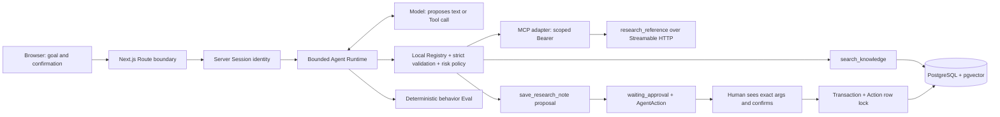

# AI Research Agent：架构与安全边界

这份文档补充项目 README，说明一次请求在什么地方取得身份、调用工具、等待审批和落库。4.8 只交付已有系统；Agent Runtime、Registry、Provider 与数据库语义来自 4.1～4.7。



**模型没有数据库权限、Session 身份决定权或自动批准写入的权力。** 模型输出的是候选动作；服务端依次验证、授权和执行。远端 MCP 元数据不能扩展本地 Registry。

## Request 与信任边界

| 来源 | 如何处理 |
| --- | --- |
| 服务端 Session | 决定当前用户 ID；所有私有检索、Run 读取与确认均按它约束。 |
| 本地 Tool Registry / Policy | 定义唯一可用的 Tool、strict Zod 参数、`read` 或 `write` 风险和执行实现。 |
| PostgreSQL 约束 | Run/Action 归属、一条 Action 的唯一业务 key、Resource 的唯一键。 |
| 用户 goal、浏览器字段、模型输出 | 不可信输入；不能指定 ownerId、工具实现、审批状态或风险级别。 |
| Knowledge Chunk、MCP 输出 | 不可信文本数据；不能变成系统指令或写入许可。 |

Route 检查登录、请求来源、JSON 与频率；Runtime 检查步骤、Tool 次数、Provider 预算、超时和取消。一次模型 turn 最多接受一个工具调用。模型可见 JSON Schema 用于提议参数，真正执行前由服务端 strict Zod 重新验证。工具结果以 `role: tool` 返回，执行权仍在应用。

## Read：自己的知识库

```text
Model → search_knowledge(query) → Registry strict validation
      → current Session userId → owner-filtered pgvector SQL
      → title / position / short preview / similarity → role: tool
```

模型只提供 query，不能提交 ownerId。先按 owner 筛选再做 Top-K，因此别人的高相似 Chunk 不会挤进当前用户结果。返回给模型和 UI 的是安全摘要，不是向量或完整私有 Chunk。Embedding 工作先预留预算，取消后不启动下一步。

## Write：提议、审批、事务

```text
Model proposal → strict title/content validation → waiting_approval
  → persisted AgentAction with canonicalArgs → user sees exact args
  → confirm with current Session + signed short-lived token
  → transaction locks Action row → Resource.create → mark executed
  → completed
```

`save_research_note` 标为 `write`，其普通 `execute` 路径直接拒绝；模型只能提出提议。确认请求不能用浏览器传入的新标题或内容替换已绑定参数，确认阶段也不再询问模型。Action 的 `idempotencyKey` 与 Resource 的 UNIQUE `agentActionKey` 让同一动作的重复确认返回同一个业务结果。事务中途失败时，Resource 与 Action 状态一起回滚。幂等范围是**同一 AgentAction 对一条 Resource**，不是任意外部请求的全系统 exactly-once。

Run、Step、Action 持久化在 PostgreSQL。刷新或重启后，`waiting_approval` 可从服务端重新读取并取得新的短期确认 Token。可恢复的 Provider 故障和预算不足写为 `paused`；Resume 以原子状态切换抢执行权，并从安全只读检查点再做必要工作。`running` 如果在下一个持久化 checkpoint 前崩溃，没有后台 Worker 自动拾取。

## MCP：协议接入不等于授权

```text
Local Registry research_reference (read)
  → MCP adapter → scoped, short-lived Bearer
  → Streamable HTTP /api/mcp/reference
  → strict result schema → untrusted role: tool data
```

当前 MCP endpoint 由应用自身提供，读取公开参考，不发送个人知识库。生产 `MCP_REFERENCE_URL` 必须指向该部署的 HTTPS endpoint；`MCP_AUTH_SECRET` 与审批 Secret 是不同的服务端随机值。远端若多报写 Tool，本地 Registry 也不会自动接受。MCP 鉴权、host/origin 与请求频率在服务端检查。

## Eval 与运行边界

20 个固定主案例、73 个子案例把 Mock/Stub、HTTP、MCP 和隔离 PostgreSQL 事实放在一起。`cross_user_leaks`、`unapproved_writes`、`duplicate_confirmed_writes` 各自必须是 0；任何一个大于 0 都失败，不能被通过率平均掉。报告中的延时只是小样本教学观察值。真实 Production Smoke 验证部署连通性，不替代安全 Eval，也不验证模型回答必然正确。

当前没有后台 Worker/Queue、多实例 execution lease；请求、Provider、MCP 限流是单实例内存。真实模型 `tool_choice=auto` 可能直答；Provider、数据库和 MCP 可临时不可用。页面将 `budget_exhausted`、`paused`、`failed`、`cancelled` 与 `waiting_approval` 作为受控状态展示，不把原始 Provider JSON 或堆栈交给用户。
