# AIFoundry 教学配图 V2｜四组样板审阅

本目录仅供第一轮构图审阅，提交到 GitHub 的是样板审阅资料，并非正式课程配图。V1 图片仍是 `public/course-media/stage-2/` 中的线上成品；课程 Markdown、图号和引用均未修改。点击候选原图可查看完整分辨率。总览图上方并排展示 V1、候选 A、候选 B，下方展示各图在约 335px 课程宽度下的效果。

## S2-3-02｜Migration 与数据操作

[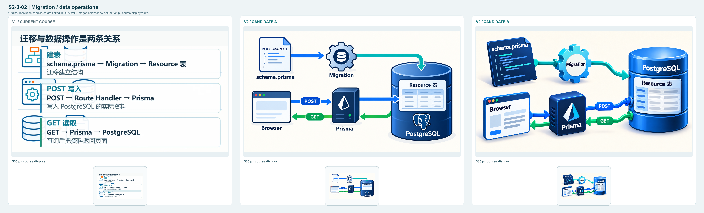](s2-3-02-overview.png)

| V1 | 候选 A | 候选 B |
| --- | --- | --- |
| 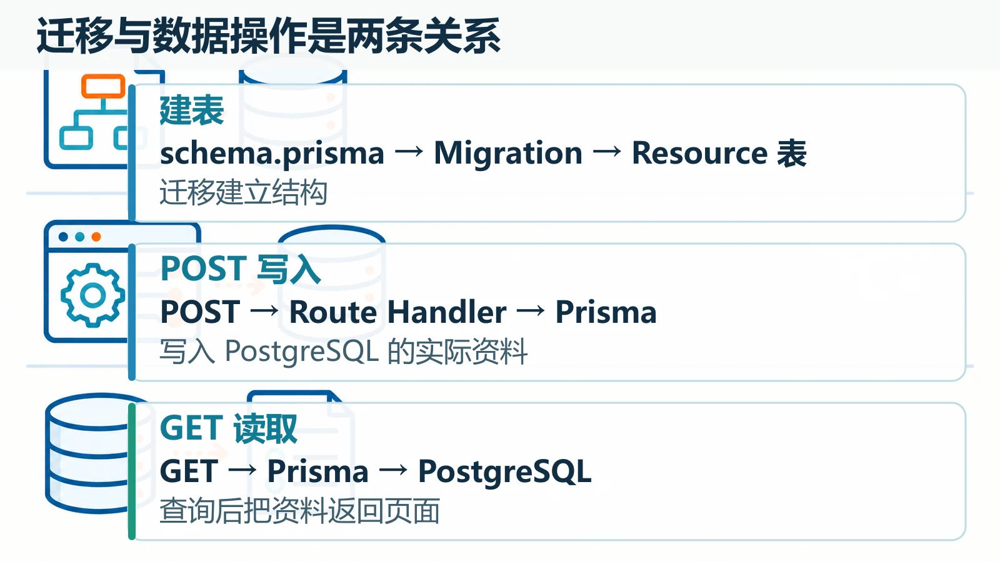 | 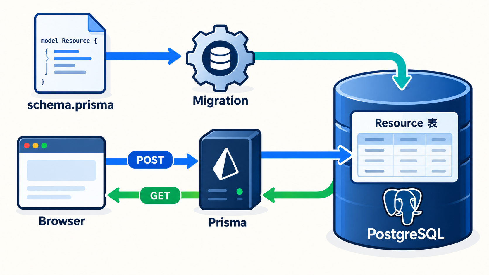 | 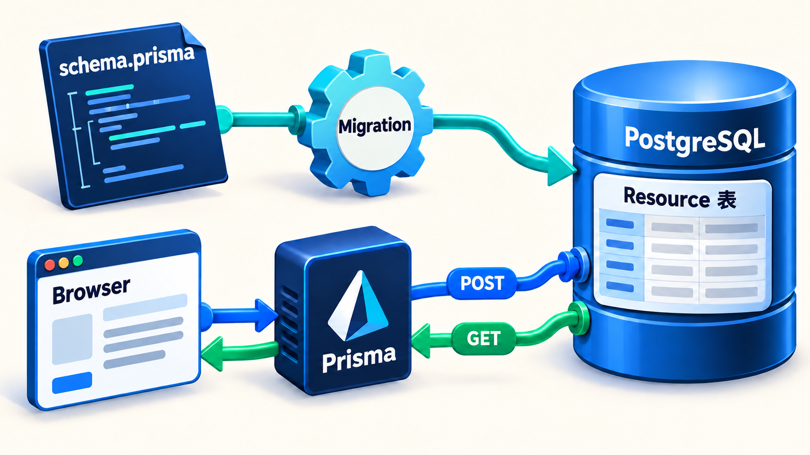 |

- V1：三个横向文字框盖住底图，需按句子理解关系。
- A：PostgreSQL 是右侧主体；上方建结构，下方 Browser、Prisma、数据库的 POST/GET 用两种颜色连接。
- B：单一数据库承接两条路径，schema.prisma → Migration → Resource 表与 POST/GET 分开。GET 从数据库经 Prisma 回到 Browser。

## S2-5-01｜Session 保持登录

[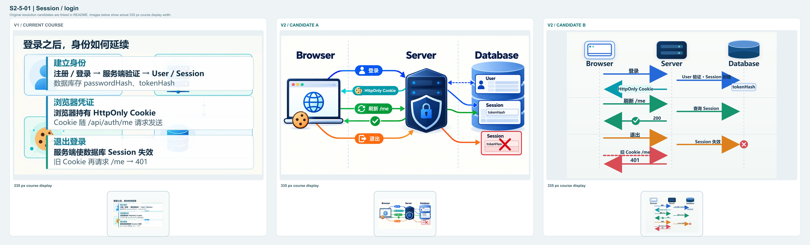](s2-5-01-overview.png)

| V1 | 候选 A | 候选 B |
| --- | --- | --- |
| 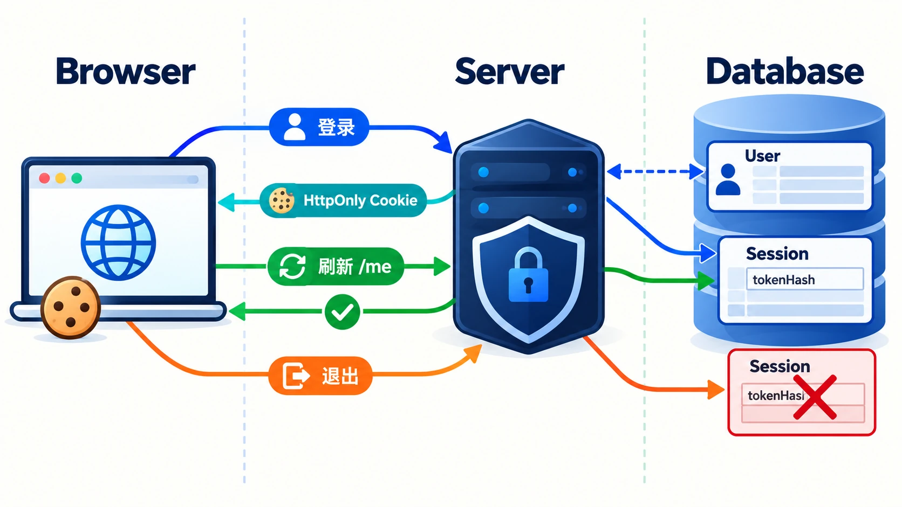 | 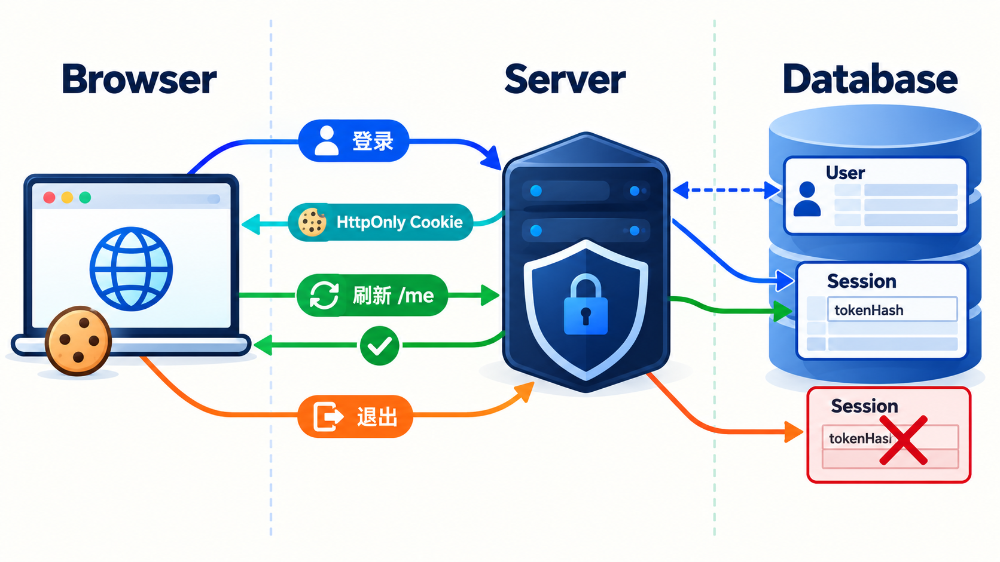 | 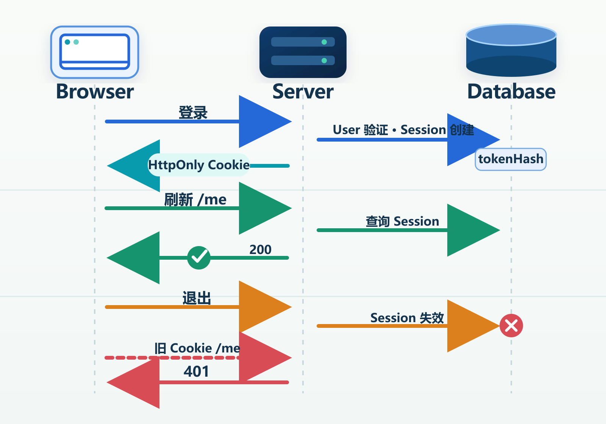 |

- V1：登录、Cookie、退出各用一段文字表达，底层 Browser/Server/Database 被遮住。
- A：三处系统位置固定，蓝色登录、青色 Cookie、绿色刷新、橙色退出直接沿节点连线。
- B：从头设计的 SVG 时序信息图；同一组三个主体沿时间线展示 Session 创建、Cookie 返回、刷新校验、退出失效，以及旧 Cookie 再请求得到 401。提供 [SVG 源文件](s2-5-01-b.svg)。

## S2-6-01｜服务端所有权隔离

[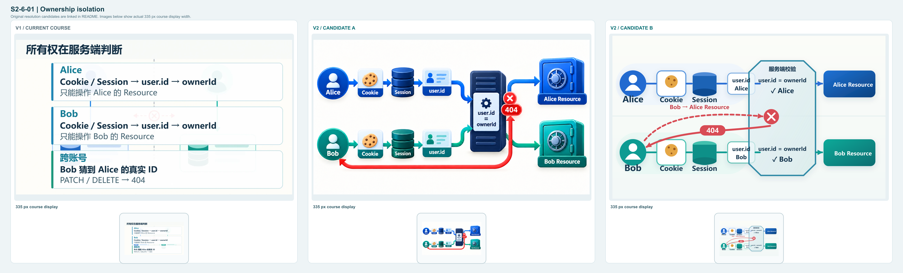](s2-6-01-overview.png)

| V1 | 候选 A | 候选 B |
| --- | --- | --- |
| 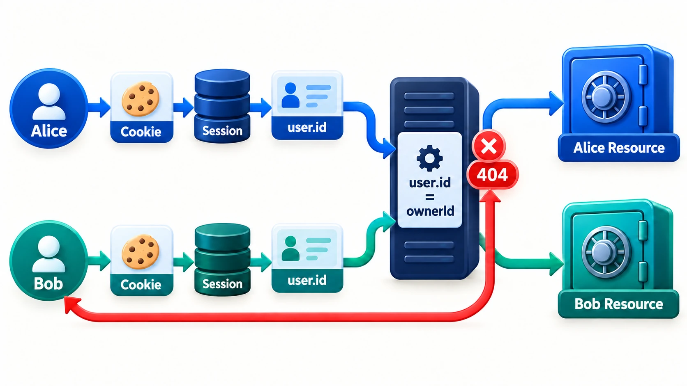 |  | 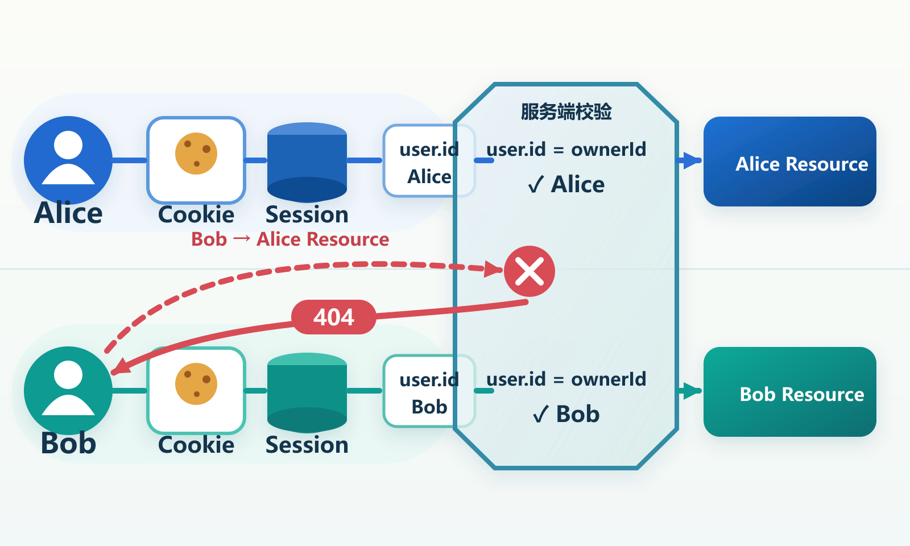 |

- V1：Alice、Bob 与跨账号结果分别是文字段落，实际权限闸门不突出。
- A：两条通道分别进入服务端，对应不同 Resource；红色 404 回到 Bob。红色尝试的起点与闸门判断较 B 版不够明确。
- B：从头设计的 SVG 闸门图；蓝、绿路径只通向各自资源，Bob → Alice Resource 的红色虚线止于服务端红叉，404 返回 Bob。提供 [SVG 源文件](s2-6-01-b.svg)。

## S2-8-01｜全栈交付架构

[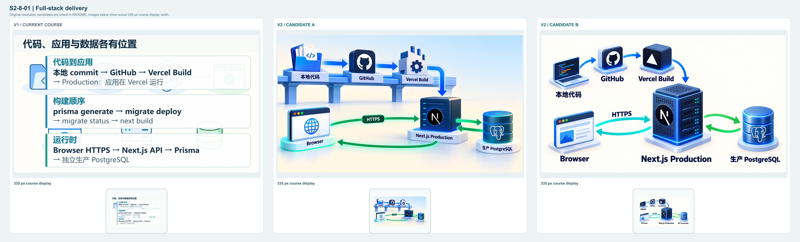](s2-8-01-overview.png)

| V1 | 候选 A | 候选 B |
| --- | --- | --- |
| 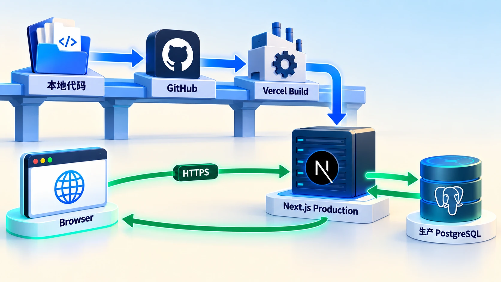 | 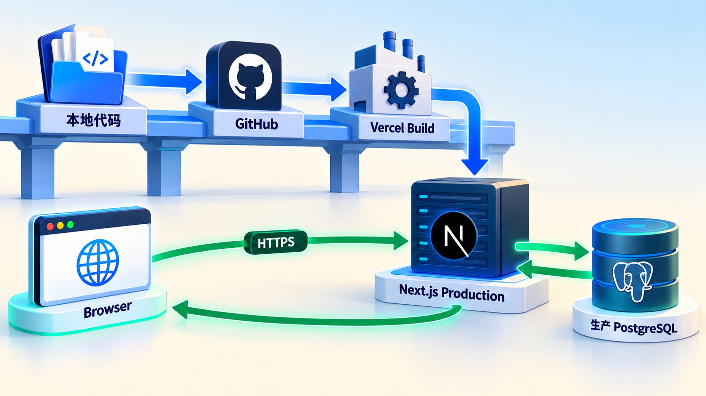 | 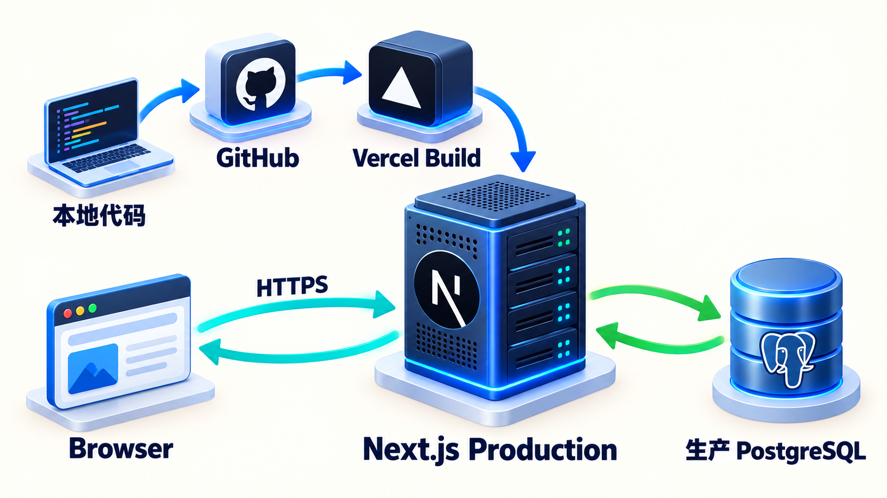 |

- V1：主要内容是三段横向说明；代码、应用和数据库虽然有图标，但彼此关系被文字压住。
- A：蓝色高架路径从本地代码经 GitHub、Vercel Build 到 Next.js Production；下方绿色箭头专门表示运行时请求与数据库访问。
- B：中心是 Next.js Production；上方蓝色构建弧线与下方 Browser/数据库双向运行链分开，生产 PostgreSQL 不属于 GitHub 或 Build。

## 实际查看与待定项

八张候选均已打开原尺寸检查，并按课程中约 335px 的图片宽度缩小查看。四组候选的主要节点和箭头方向可辨；S2-5 与 S2-6 的小标签在手机尺寸仍较密，正式选定方案后需继续扩大关键标签并在真实课程页复验。S2-6 的 B 版在越权路径上比 A 版更明确。候选图尚未进入课程页，不能记作正式课程视觉验收。

其中六张 PNG 以 Codex 内置 image_gen 直接生成完整信息图，针对 S2-3-02 B、S2-6-01 A、S2-8-01 A 做了局部图像编辑。S2-5-01 B 与 S2-6-01 B 因复杂箭头关系的生图尝试不稳定，改用完整自主设计的 SVG 信息图，并渲染为 PNG 供对比。未使用 V1 的“空白底图 + 大块文字面板”工艺。

## 最终候选使用的提示词概念

- S2-3-02 A：以 PostgreSQL/Resource 表为视觉中心；上方 schema.prisma → Migration → Resource 表，下方 Browser → POST → Prisma → PostgreSQL，GET 反向经 Prisma 回 Browser。
- S2-3-02 B：同一单体数据库承接迁移和数据操作，禁止绘出第二座数据库；POST 蓝色去程与 GET 绿色回程完整分开。
- S2-5-01 A：Browser、Server、Database 三个区域，依次画登录验证、Cookie 返回、刷新 /me 校验 Session、退出使 Session 失效；数据库只存 tokenHash。
- S2-5-01 B：矢量时序图，三主体固定、时间向下；按箭头展示登录、Session 创建、Cookie、刷新 /me、退出、旧 Cookie 后续 401。
- S2-6-01 A：Alice 与 Bob 两条独立通道，Cookie/Session 映射 user.id；服务端依据 ownerId 放行各自 Resource，Bob 跨账号尝试在服务端终止并返回 404。
- S2-6-01 B：矢量闸门图，红色 Bob → Alice Resource 尝试止于闸门，红色 404 箭头返回 Bob，蓝绿授权路径各自独立。
- S2-8-01 A：本地代码 → GitHub → Vercel Build → Next.js Production 是蓝色交付轨道，Browser/Next.js Production/独立生产 PostgreSQL 是绿色运行轨道。
- S2-8-01 B：Next.js Production 位于中心，上方是本地代码、GitHub、Vercel Build 的构建弧线，下方 Browser 与独立生产数据库通过双向运行箭头相连。
